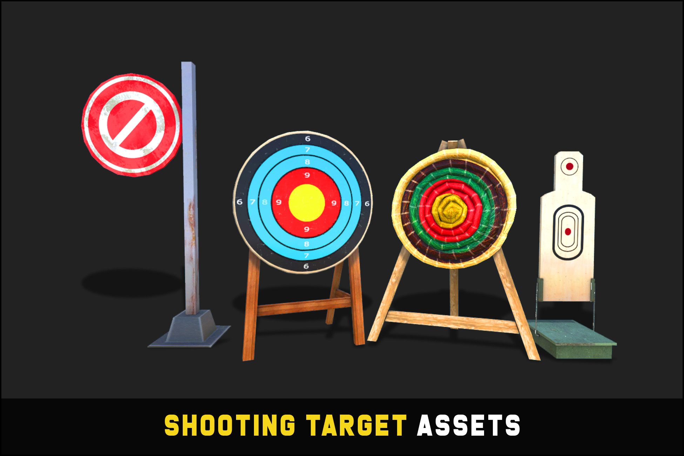

# Boxyboksers — Game Design Document

**Status:** Concept v1
**Platform:** Meta Quest (standalone VR)
**Engine:** Unity 6000.6.0f1, Universal Render Pipeline
**Input:** XR Interaction Toolkit

---

## 1. Concept & Pitch

Boxyboksers is een VR-bokssim die we bouwen als promo-/demomateriaal voor de open dagen van het Grafisch Lyceum Utrecht (GLU). De opdrachtgever wil hoogwaardig videomateriaal dat studentenwerk binnen het CSD/XR-profiel laat zien, af te spelen op grote schermen en tijdens presentaties, met als doel dat toekomstige studenten een duidelijk beeld krijgen van de opleiding en zich gaan inschrijven.

De core loop houden we expres simpel: willekeurige targets spawnen om je heen, je slaat ze kapot binnen een tijdslimiet, en een score/combo-systeem beloont snelheid en precisie. Simpel houdt de bouwtijd laag en laat de visuele kant (hit-feedback, licht, cartoony art direction) het werk doen om het "hoogwaardig en representatief" te maken.

Het is een samenwerking tussen AAV (film/video) en CSD/XR: wij bouwen en spelen de demo, AAV filmt en monteert het promomateriaal.

## 2. Doelgroep & Context

Twee doelgroepen, en dat zijn niet dezelfde mensen:

- **Degene met de headset op** hoeft geen ervaren VR-speler te zijn, maar het spel moet meteen snappen zijn. Geen tutorial, geen inwerktijd. Wie het ook demonstreert, student of bezoeker, moet er binnen een paar seconden goed uitzien.
- **Het echte publiek is de kijker van de video.** Toekomstige studenten die naar een scherm of promovideo kijken. Het spel is gemaakt om *gefilmd* te worden, niet om competitief gespeeld te worden. Dus: geen frustrerende faalmomenten, geen lange saaie stukken, en gameplay die ook van buiten de headset duidelijk leest (een toeschouwers-/camerabeeld is net zo belangrijk als het first-person-beeld).

Daarom kiezen we voor korte, visueel dichte sessies (60 seconden) in plaats van diepgang of herspeelbaarheid.

## 3. Core Gameplay Loop

1. Speler start een ronde van 60 seconden.
2. Targets spawnen één voor één (of in kleine golfjes) in een bereikbare boog voor de speler, op wisselende hoogtes.
3. Speler slaat een target kapot voordat het verdwijnt: score gaat omhoog, combo gaat omhoog, korte hit-feedback speelt af.
4. Speler mist of laat een target verlopen: combo reset.
5. Spawnsnelheid en/of levensduur van targets wordt geleidelijk zwaarder naarmate de timer afloopt.
6. Bij 0 seconden eindigt de ronde en zie je eindscore + beste combo op het scorebord.

Geen levens, geen faalstatus behalve een combo-reset. De loop loopt altijd gewoon af, wat belangrijk is voor het filmen (een demo-run mag nooit vroegtijdig eindigen omdat een bezoeker een keer mist).

## 4. Mechanics

**Target spawning**
- Targets spawnen binnen een halve cirkel/boog voor de speler, zo'n beetje van schouderbreedte tot volledige armlengte.
- Spawnposities variëren in hoogte (laag/bukken, midden, hoog/reiken) zodat je hele lichaam meedoet, niet alleen je armen.
- Eén actief target tegelijk voor de MVP, dat is het makkelijkst te tunen en te filmen. Golfgewijs spawnen ("3 tegelijk") is een leuke extra als er tijd over is.
- Een target verdwijnt automatisch na een vaste levensduur (bv. 2 à 3 seconden) als het niet geraakt wordt, en dat telt als gemist.

**Hitdetectie**
- Trigger collider op elke controller (of op een handschoen-/vuistmodel dat aan de controller hangt) detecteert overlap met de collider van een target.
- Optioneel: snelheid van de controller op het moment van impact meewegen, zodat je verschil ziet tussen een zwakke tik en een harde klap. Puur voor de feedback (visueel/audio), hoeft de score niet te beïnvloeden voor de MVP.

**Timer & Score**
- Vaste rondetimer van 60 seconden, in world-space UI.
- Elke hit geeft een basisscore.
- Opeenvolgende hits zonder missen bouwen een combo-multiplier op (bv. +10% score per hit op rij, met een plafond).
- Een miss (timeout, een "swing and miss"-detectie hebben we niet nodig want er is niets om mee te botsen) reset de combo-multiplier naar 1x.

**Moeilijkheidsopbouw**
- Gedurende de 60 seconden gaat het spawninterval omlaag en/of de levensduur van targets omlaag, zodat het tempo zichtbaar oploopt voor de camera.

## 5. Controls

- Meta Quest controllers via **XR Interaction Toolkit**.
- Geen grab-/UI-interactie nodig voor de core loop, de controller zelf (of een gekoppeld handschoenmodel) is gewoon je vuist. Beweging is stationair, je staat op je plek, geen locomotie nodig omdat de speelruimte een vaste ring/boog is.
- Package-check: XRI, XR Plugin Management en OpenXR staan **nog niet geïnstalleerd** in het project. Dat is een setup-taak voordat we input-code kunnen schrijven. Zie §11.

## 6. Art Direction & Referenties

**Referentie 1: variatie in targets** (`../Pics/targets.jpg`)

Dit plaatje laat het *principe* zien dat we willen: gevarieerde vormen en kleuren zodat je targets in één oogopslag herkent. Niet de letterlijke stijl trouwens, schiet-/boogschietschijven voelen als "wapenbaan" en dat botst met een bokspel en met het designprofiel van GLU. Onze targets worden liever **cartoony, grafisch-vormgegeven vormen**: platgekleurde geometrische blobs, ludieke mascotte-achtige iconen, of comic-achtige "POW"-panelen, in een klein setje felle kleuren dat steeds roteert. Mooie kans voor de AAV/grafisch-vormgeving-kant van de samenwerking trouwens, de targets zelf zijn een zichtbaar stukje studentenwerk.

**Referentie 2** (`../Pics/boxing2.avif`): zit in de repo voor het team, maar ik kan 'm niet als afbeelding in dit document tonen (AVIF wordt niet ondersteund door de tooling waarmee dit document geschreven is). Handig om 'm naar .jpg/.png te converteren als je 'm ergens anders wil gebruiken.

**Algemene richting:** cartoony/gestileerd in plaats van realistisch, helder en hoog-contrast voor de camera, boksschool-omgeving in plaats van een kale grijze ruimte.

## 7. Audio & Feedback

- Hit-impactgeluid, varieert een beetje per combo-niveau (wordt bijvoorbeeld heftiger bij hogere combo's).
- Miss-/timeoutgeluid, bewust zacht en niet-bestraffend, geen harde faalbuzzer, houd de toon vrolijk voor de video.
- Particle burst bij een hit, kleur kan matchen met de kleur van het target.
- Korte screen shake of camera-punch bij een hit, geeft extra impact in first-person beeldmateriaal.
- Optioneel: ambient gym-geluid (gemompel van publiek, verre bel) voor sfeer op de audiotrack van de video.

## 8. UI / HUD

- World-space canvas, geen screen-space, zodat het zowel in de headset als op een externe toeschouwerscamera/opname goed leesbaar is.
- Elementen: aftellende timer, huidige score, huidige combo-multiplier.
- Eindsamenvatting: eindscore, beste combo.

## 9. Omgeving

- Boksschool-esthetiek: ring of ring-aangrenzende ruimte, sfeervolle gekleurde verlichting, genoeg aankleding (touwen, bokszakken, posters) zodat het niet als een lege grijze doos oogt op camera.
- Omgeving blijft klein en statisch, het is een decor voor gameplay/filmen, geen wereld om te verkennen.

## 10. Scope

**MVP (moet erin zitten om de demo filmbaar te maken)**
- Target-spawner (boog + hoogtevariatie)
- Hitdetectie met visuele/audio-feedback
- 60s timer + world-space score/combo-UI
- Auto-despawn bij missen + combo-reset
- Moeilijkheidsopbouw gedurende de ronde
- Boksschool-omgeving met basisverlichting

**Nice-to-have (als er tijd over is)**
- Links/rechts-handkleuring van targets (BoxVR-stijl)
- Haptic feedback bij een hit
- Golfgewijs (meerdere tegelijk) spawnen van targets
- Power-punch-detectie (snelheidsgebaseerd) die de intensiteit van de visuele feedback beïnvloedt
- Ambient publiek-/gym-geluidsbed

## 11. Technische Specificaties

- Unity 6000.6.0f1, Universal Render Pipeline, staat al goed in het project.
- Doelplatform: Meta Quest (standalone), input via **XR Interaction Toolkit**.
- Nog niet in het project, maar wel nodig voordat we input-/interactiecode kunnen schrijven: `com.unity.xr.interaction.toolkit`, `com.unity.xr.management`, en een OpenXR-provider (`com.unity.xr.openxr`). Geen van deze staat nu in `Packages/manifest.json`.
- Doel-framerate: 72 à 90fps, afhankelijk van het Quest-headsetmodel, volgens de VR-frame-budget-richtlijn in CLAUDE.md.
- Houd je aan de Unity 3D-regels uit CLAUDE.md voor dit project: object pooling voor targets omdat ze continu spawnen/despawnen, geen allocaties per frame in Update/FixedUpdate, physics-writes in FixedUpdate, layer masks op alle hitdetectie-colliders.

## 12. Open Vragen / Risico's

- Welk(e) Quest-model(len) we precies beschikbaar hebben om op te testen (beïnvloedt performance-marge en framerate-doel).
- Of de power punch (snelheidsgebaseerde feedback) de tuning-tijd waard is binnen het MVP-tijdsbestek, want die beïnvloedt de score niet.
- De uiteindelijke visuele stijl van de targets is nog niet ontworpen, zie §6 als samenwerkingspunt met AAV/grafisch vormgeving.
- Of we een toeschouwers-/externe camerahoek nodig hebben om te filmen, of dat AAV de headset-drager direct filmt plus een monitor die het in-headset-beeld spiegelt.
