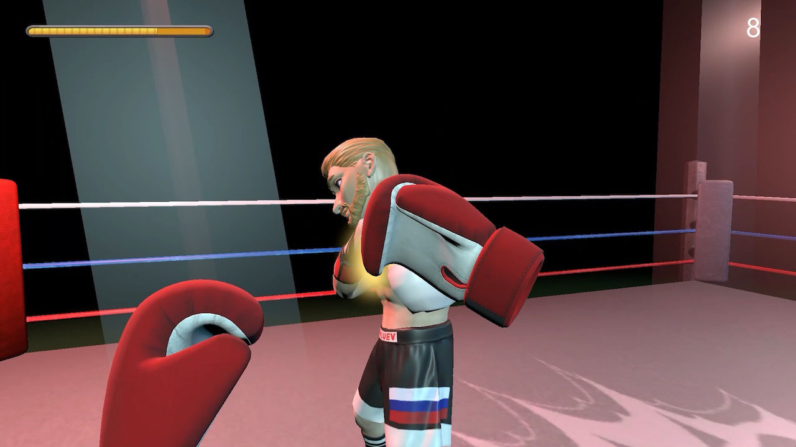

# Boxyboksers — Game Design Document

**Status:** Concept v1
**Platform:** Meta Quest (standalone VR)
**Engine:** Unity 6000.6.0f1, Universal Render Pipeline
**Input:** XR Interaction Toolkit

---

## 1. Concept & Pitch

Boxyboksers is een VR-bokssim, gebouwd als promotie-/demomateriaal voor de open dagen van het Grafisch Lyceum Utrecht (GLU). De opdrachtgever vroeg om hoogwaardig videomateriaal dat studentenwerk binnen het CSD/XR-profiel laat zien, af te spelen op grote schermen en tijdens presentaties, met als doel toekomstige studenten een duidelijk beeld van de opleiding te geven en ze over te halen zich in te schrijven.

De core loop is bewust simpel: willekeurige targets spawnen rondom de speler, de speler slaat ze binnen een tijdslimiet kapot, en een score/combo-systeem beloont snelheid en precisie. Die eenvoud houdt de bouwtijd laag en laat de visuele presentatie — hit-feedback, lichtopstelling, cartoony art direction — het zware werk doen voor het "hoogwaardig en representatief"-vereiste.

Dit is een gezamenlijk AAV (film/video) + CSD/XR-project: XR bouwt en speelt de demo, AAV filmt en monteert het promomateriaal ervan.

## 2. Doelgroep & Context

Er zijn twee doelgroepen, en dat zijn niet dezelfde mensen:

- **Degene met de headset op** hoeft niet per se een ervaren VR-speler te zijn, maar het spel moet meteen begrijpelijk zijn — geen tutorial, geen inwerktijd nodig. Wie het ook demonstreert (student of bezoeker), moet er binnen een paar seconden vaardig uitzien.
- **Het eigenlijke publiek is de kijker van de video** — toekomstige studenten die naar een scherm of promovideo kijken. Het spel is ontworpen om *gefilmd* te worden, niet om competitief gespeeld te worden. Dat betekent: geen frustrerende faalmomenten, geen lange dode momenten, en gameplay die ook van buiten de headset duidelijk leesbaar is (een toeschouwers-/camerabeeld is net zo belangrijk als het first-person-beeld).

Daarom kiest het ontwerp voor korte, visueel dichte sessies (60 seconden) boven diepgang of herspeelbaarheid.

## 3. Core Gameplay Loop

1. Speler start een ronde van 60 seconden.
2. Targets spawnen één voor één (of in kleine golfjes) in een bereikbare boog voor de speler, op wisselende hoogtes.
3. Speler slaat een target kapot voordat het verdwijnt → score gaat omhoog, combo gaat omhoog, korte hit-feedback speelt af.
4. Speler mist / laat een target verlopen → combo reset.
5. Spawnsnelheid en/of levensduur van targets wordt geleidelijk zwaarder naarmate de timer afloopt.
6. Bij 0 seconden: ronde eindigt, eindscore + beste combo worden getoond op het scorebord.

Geen levens, geen faalstatus behalve een combo-reset — de loop loopt altijd af, wat belangrijk is voor het filmen (een demo-run mag nooit "vroegtijdig eindigen" door een fout van een bezoeker).

## 4. Mechanics

**Target spawning**
- Targets spawnen binnen een halve cirkel/boog voor de speler, ongeveer van schouderbreedte tot volledige armlengte afstand.
- Spawnposities variëren in hoogte (laag/bukken, midden, hoog/reiken) zodat het hele lichaam van de speler wordt aangesproken, niet alleen de armen.
- Eén actief target tegelijk voor de MVP (makkelijkst te tunen en te filmen); golfgewijs spawnen ("3 tegelijk") is een stretch goal als er tijd over is.
- Een target verdwijnt automatisch na een vaste levensduur (bv. 2–3s) als het niet geraakt wordt, en telt als gemist.

**Hitdetectie**
- Trigger collider op elke controller (of op een handschoen-/vuistmodel dat aan de controller hangt) detecteert overlap met de collider van een target.
- Optioneel: snelheid van de controller op het moment van impact meewegen om onderscheid te maken tussen een "zwakke tik" en een "krachtige klap", puur voor feedbackdoeleinden (visueel/audio — hoeft de score niet te beïnvloeden voor de MVP).

**Timer & Score**
- Vaste rondetimer van 60 seconden, getoond in world-space UI.
- Elke hit voegt een basisscore toe.
- Opeenvolgende hits zonder missen bouwen een combo-multiplier op (bv. +10% score per opeenvolgende hit, met een plafond).
- Een miss (timeout — een "swing and miss"-detectie is niet nodig omdat er niets is om mee te botsen) reset de combo-multiplier naar 1x.

**Moeilijkheidsopbouw**
- Gedurende de 60 seconden neemt het spawninterval af en/of de levensduur van targets af, zodat het tempo zichtbaar oploopt voor de camera.

## 5. Controls

- Meta Quest controllers via **XR Interaction Toolkit**.
- Geen grab-/UI-interactie nodig voor de core loop — de controller zelf (of een gekoppeld handschoenmodel) is de "vuist". Beweging is stationair (speler staat op zijn plek); geen locomotie nodig omdat de speelruimte een vaste ring/boog is.
- (Package-check: XRI, XR Plugin Management en OpenXR staan **nog niet geïnstalleerd** in het project — dit is een setup-taak voordat er input-code geschreven kan worden. Zie §11.)

## 6. Art Direction & Referenties

**Referentie 1 — Wii Sports Boxing-stijl** (`../Pics/boxing.jpg`)

Belangrijkste punten voor onze art direction: overdreven, ronde personageproporties; heldere, verzadigde ringverlichting (gekleurde spots die door waas snijden); simpele, hoog-contrast world-space HUD (een balk linksboven, een los getal rechtsboven). Wij hebben geen tegenstander-personage, maar de lichtopstelling en de leesbaarheid van de HUD zijn direct herbruikbaar.

**Referentie 2 — Variatie in targets** (`../Pics/targets.jpg`)

Dit vel toont het *principe* dat we willen (gevarieerde vormen en kleuren zodat targets in één oogopslag herkenbaar zijn), maar niet de letterlijke stijl — schiet-/boogschietschijven lezen als "wapenbaan", wat botst met een bokspel en met het designprofiel van GLU. Onze targets moeten in plaats daarvan **cartoony, grafisch-vormgegeven vormen** zijn: platgekleurde geometrische blobs, ludieke mascotte-achtige iconen, of comic-achtige "POW"-panelen, in een klein roulerend setje felle kleuren. Zie dit als een designkans voor de AAV/grafisch-vormgeving-kant van de samenwerking — de targets zelf zijn een zichtbaar stukje "studentenwerk".

**Referentie 3** (`../Pics/boxing2.avif`) — zit in de repo voor het team maar kan niet als afbeelding in dit document getoond worden (AVIF wordt niet ondersteund door de tooling waarmee dit document is geschreven); de moeite waard om naar `.jpg`/`.png` te converteren als hij elders nodig is.

**Algemene richting:** cartoony/gestileerd boven realistisch, helder en hoog-contrast voor de camera, boksschool-omgeving in plaats van een kale grijze ruimte.

## 7. Audio & Feedback

- Hit-impactgeluid (varieert licht per combo-niveau, bv. wordt "punchier"/lagiger bij hogere combo's).
- Miss-/timeoutgeluid, bewust zacht/niet-bestraffend (geen harde "fail"-buzzer — houd de toon vrolijk voor de video).
- Particle burst bij een hit (kleur kan matchen met de kleur van het target).
- Korte screen shake / camera-punch bij een hit voor extra impact in first-person beeldmateriaal.
- Optioneel: ambient gym-geluid (gemompel van publiek, verre bel) voor sfeer op de audiotrack van de video.

## 8. UI / HUD

- World-space canvas (geen screen-space) zodat het zowel in de headset als op een externe toeschouwerscamera/opname goed leesbaar is.
- Elementen: aftellende timer, huidige score, huidige combo-multiplier.
- Eindsamenvatting-paneel: eindscore, beste combo.

## 9. Omgeving

- Boksschool-esthetiek: ring of ring-aangrenzende ruimte, sfeervolle gekleurde verlichting (sluit aan bij referentie 1), genoeg aankleding (touwen, bokszakken, posters) zodat het niet als een lege grijze doos oogt op camera.
- Omgeving moet klein en statisch blijven — dit is een decor voor gameplay/filmen, geen verkenbare wereld.

## 10. Scope

**MVP (must-have om de demo filmbaar te maken)**
- Target-spawner (boog + hoogtevariatie)
- Hitdetectie met visuele/audio-feedback
- 60s timer + world-space score/combo-UI
- Auto-despawn bij missen + combo-reset
- Moeilijkheidsopbouw gedurende de ronde
- Boksschool-omgeving met basisverlichting

**Nice-to-have (als er tijd over is)**
- Links/rechts-handkleuring van targets (BoxVR-stijl)
- Haptic feedback bij een hit
- Golfgewijs (meerdere tegelijk) spawnen van targets
- Power-punch-detectie (snelheidsgebaseerd) die de intensiteit van de visuele feedback beïnvloedt
- Ambient publiek-/gym-geluidsbed

## 11. Technische Specificaties

- Unity 6000.6.0f1, Universal Render Pipeline (al ingesteld in het project).
- Doelplatform: Meta Quest (standalone), input via **XR Interaction Toolkit**.
- **Nog niet in het project en nodig voordat input-/interactiecode geschreven kan worden:** `com.unity.xr.interaction.toolkit`, `com.unity.xr.management`, en een OpenXR-provider (`com.unity.xr.openxr`) — geen van deze staat nu in `Packages/manifest.json`.
- Doel-framerate: 72–90fps afhankelijk van het Quest-headsetmodel, conform de VR-frame-budget-richtlijn in CLAUDE.md.
- Volg de Unity 3D-regels uit CLAUDE.md voor dit project (object pooling voor targets omdat ze continu spawnen/despawnen, geen allocaties per frame in Update/FixedUpdate, physics-writes in FixedUpdate, layer masks op alle hitdetectie-colliders).

## 12. Open Vragen / Risico's

- Welk(e) Quest-model(len) precies beschikbaar zijn om op te testen (beïnvloedt performance-marge en framerate-doel).
- Of de "power punch" (snelheidsgebaseerde feedback) de tuning-tijd waard is binnen het MVP-tijdsbestek, aangezien het de score niet beïnvloedt.
- De uiteindelijke visuele stijl van de targets is nog niet ontworpen — gemarkeerd in §6 als samenwerkingspunt met AAV/grafisch vormgeving.
- Of er een toeschouwers-/externe camerahoek nodig is om te filmen, of dat AAV de headset-drager direct filmt plus een monitor die het in-headset-beeld spiegelt.
